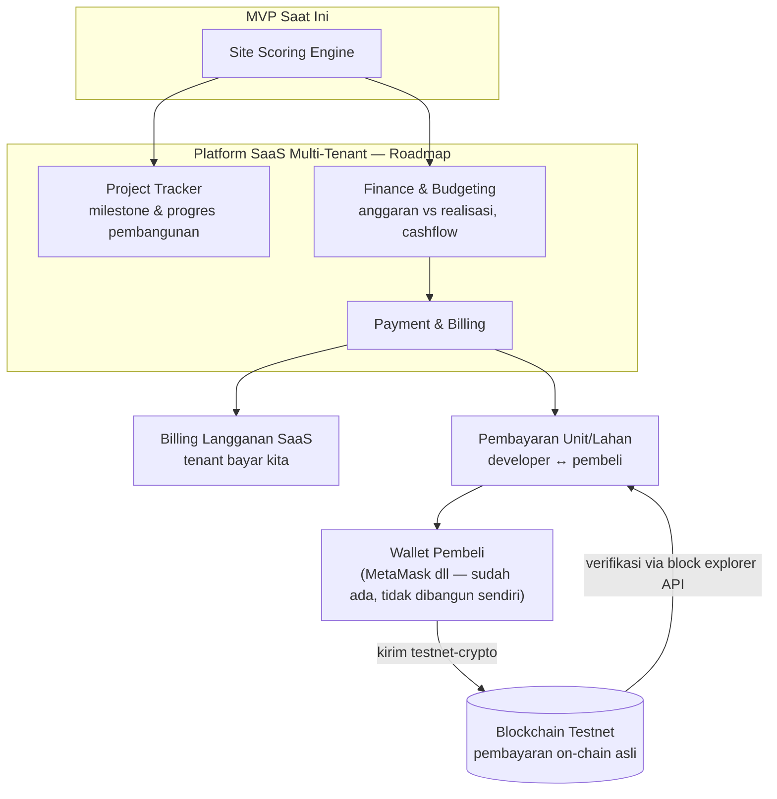

# BanguninAja

**Sistem Pendukung Keputusan Penentuan Lokasi Berbasis GIS**

Menentukan lokasi paling ideal untuk mendirikan bangunan — hunian, rumah sakit, mall, atau tempat hiburan — berdasarkan kondisi geografis, demografis, dan risiko wilayah.

> Proyek AOL — **COMP6100001 Software Engineering**, Semester Ganjil 2026/2027
> Universitas Bina Nusantara

---

## Masalah

Developer properti menentukan lokasi berdasarkan **intuisi dan harga tanah murah**. Akibatnya: mall sepi, perumahan kebanjiran, rumah sakit menumpuk di satu area sementara wilayah lain tidak terlayani.

Data untuk memutuskan dengan benar sebenarnya **sudah tersedia dan terbuka** — hanya tersebar di banyak portal dan tidak pernah disatukan.

## Solusi

Satu mesin skoring, beberapa profil bangunan. Kriteria dan bobotnya berbeda per profil, mesinnya sama.

| Profil | Kriteria utama |
|--------|----------------|
| Hunian | Harga tanah, akses transport, sekolah, rawan banjir, keamanan |
| Rumah sakit | Kepadatan penduduk, faskes eksisting, akses jalan, luas lahan |
| Mall / retail | Daya beli, lalu lintas pejalan, kompetitor, parkir |
| Hiburan / F&B | Demografi usia, kompetitor, zonasi, akses malam |

> Pendekatan ini adalah **product-line software** — arsitektur dan komponen inti sama untuk beberapa varian produk.

---

## Fitur Utama

| # | Fitur | Ringkas |
|---|-------|---------|
| 1 | Manajemen data spasial | Import & validasi data peta, dengan versioning |
| 2 | Profil & bobot kriteria | User pilih jenis bangunan, atur bobot sendiri |
| 3 | Analisis & ranking lokasi | Skor tiap kandidat **beserta alasannya** |
| 4 | Cek zonasi & perizinan | Lokasi bagus tapi zonanya terlarang = percuma |
| 5 | Analisis kompetitor | Radius, kanibalisasi, celah pasar |
| 6 | Simulasi what-if | Bandingkan beberapa kandidat berdampingan |
| 7 | Laporan investasi | Estimasi biaya, proyeksi permintaan, ekspor PDF |

## Aktor

Developer/investor · Analis lokasi · Konsultan properti · Admin data · Pemda (validasi zonasi)

## SDG

- **SDG 11** — Sustainable Cities and Communities *(utama)*
- **SDG 8** — Decent Work and Economic Growth *(pendukung)*

---

## Ruang Lingkup

**Termasuk:** input & pengelolaan data spasial, analisis multi-kriteria, perankingan lokasi, pengecekan zonasi, visualisasi peta, laporan rekomendasi.

**Tidak termasuk:** proses jual-beli lahan, perizinan resmi (IMB/PBG), konstruksi, dan operasional bangunan.

---

## Visi Produk: Dari Site-Scoring ke Platform ERP

Scope MVP di atas (site-scoring) adalah **fondasi**, bukan produk akhir. Visi jangka panjangnya: platform **SaaS multi-tenant** untuk perusahaan developer properti — satu instance melayani banyak perusahaan, data terisolasi per tenant.



Modul roadmap (belum diimplementasi, MVP tetap fokus scoring):

| Modul | Fungsi |
|---|---|
| **Project Tracker** | Milestone & progres pembangunan per proyek, terhubung ke hasil scoring lokasi |
| **Finance** | Anggaran vs realisasi, cashflow proyek — perluasan dari fitur "Laporan Investasi" yang sudah ada |
| **Payment & Billing** | Dua lapis: (1) billing langganan SaaS dari tenant ke kami, (2) pembayaran unit/lahan developer↔pembeli **on-chain beneran** (bukan cuma dicatat) — lihat desain di bawah |

### Desain Payment On-Chain (tanpa bikin consumer app)

Nilai transaksi properti besar → perlu jaminan keamanan & audit trail yang tidak bisa diubah. Blockchain dipakai sebagai **jalur pembayaran itu sendiri**, bukan cuma pencatatan — tapi tanpa perlu membangun aplikasi konsumen terpisah:

1. Seller app (bagian dari platform kami) generate **permintaan pembayaran**: nominal + alamat wallet tujuan (ditampilkan sebagai QR code)
2. Pembeli kirim sejumlah **testnet-crypto** dari wallet pribadinya (MetaMask atau sejenis — tool generik yang sudah ada, bukan yang kami bangun) ke alamat tersebut
3. Seller app **verifikasi** transaksi masuk lewat block explorer API (Etherscan/Polygonscan, gratis) — cocokkan jumlah & alamat, lalu tandai lunas

Testnet publik dipilih karena **budget 0** — transaksi tercatat on-chain sungguhan, cuma jaringannya gratis (bukan mainnet berbayar).

**Batasan realistis:** dibangun dengan **budget 0** — stack open-source, hosting free-tier, dan pencatatan blockchain pakai **testnet publik** (gratis, bukan mainnet berbayar).

---

## Desain Data

Rincian lengkap: [`docs/architecture/desain-data.md`](docs/architecture/desain-data.md)

Desain ini menjawab satu pertanyaan: **tiap dataset kerjanya apa di aplikasi?**
Jawabannya ada empat jenis pekerjaan, dan tiap dataset kebagian satu.

| Pekerjaan | Artinya | Dataset |
|---|---|---|
| **1. Mencoret** | Buang lokasi yang tidak boleh dibangun | Lahan terlarang (303.238 objek), kawasan hutan |
| **2. Mencari** | Kumpulkan lokasi calon | Lahan layak bangun (106.467), bangunan komersial (48.501), batas wilayah |
| **3. Menilai** | Beri nilai ke tiap calon | ZNT, 12 layer bahaya, WorldPop, POI kompetitor, jalan, DEM, hidrologi |
| **4. Melaporkan** | Isi laporan setelah lokasi terpilih | IKK, BI SHPR, kriminalitas, SoilGrids, DEMNAS |

Yang kerjanya **menilai** jumlahnya banyak. Kalau masing-masing jadi kriteria
sendiri, bobotnya terpecah dan peringkatnya kabur. Karena itu digabung menjadi
**enam penilaian**:

| Penilaian | Digabung dari |
|---|---|
| Risiko Bencana | 12 layer InaRISK |
| Permintaan Pasar | WorldPop + PDRB + penduduk BPS |
| Kompetisi | POI kompetitor |
| Aksesibilitas | Jalan + transit + jangkauan faskes |
| Biaya Lahan | ZNT |
| Kelayakan Fisik | Kemiringan DEM + jarak sungai |

Bobot bawaannya berbeda per profil bangunan dan dapat diubah pengguna. Hunian
menomorsatukan Biaya Lahan (30%) dan Risiko Bencana (25%); F&B menomorsatukan
Permintaan Pasar dan Kompetisi (masing-masing 25%).

### Contoh: membangun mall di Bandung

| Langkah | Yang terjadi | Dataset |
|---|---|---|
| 1 | Ambil batas Bandung | GADM |
| 2 | Bangun petak 92 m, khusus Bandung | — |
| 3 | Coret petak yang menyentuh taman, sekolah, sungai | Lahan terlarang |
| 4 | Kumpulkan lahan kosong yang tersisa | Lahan layak bangun |
| 5 | Nilai tiap lahan pada enam penilaian | ZNT, InaRISK, WorldPop, dst |
| 6 | Gabungkan memakai bobot profil mall | — |
| 7 | Buang yang melebihi budget | ZNT + input user |
| 8 | Tampilkan peringkat beserta alasannya | — |
| 9 | Lokasi terpilih dibuatkan laporan | IKK, BI SHPR, SoilGrids |

Langkah 2 adalah alasan sistem ini bisa berskala nasional: petak dibuat sesuai
permintaan. Seluruh Indonesia pada petak 92 m berarti 224 juta petak, tidak
mungkin dihitung. Satu kecamatan hanya sekitar 1.800 petak.

### Yang sengaja tidak ikut menilai

- **Kriminalitas** berhenti di level kabupaten/kota, sehingga semua calon di
  dalam satu wilayah bernilai sama persis. Kriteria yang tidak membedakan tidak
  mengubah urutan berapa pun bobotnya.
- **Patahan aktif** sudah tercermin di indeks bahaya gempa — dipakai terpisah
  berarti menghitung faktor yang sama dua kali.
- **IKK dan BI SHPR** menghasilkan angka *setelah* lokasi terpilih.
- **DEMNAS 8 m** lebih halus dari petak 92 m, detailnya hilang dirata-ratakan.

### Tiga keputusan yang masih menunggu kesepakatan tim

Mesin skoring MCDM atau model prediktif · nasib label presence-only · cakupan
fitur "Cek zonasi" setelah RDTR dipastikan tidak tersedia. Ketiganya dibahas
lengkap beserta rekomendasi di dokumen desain.

---

## Struktur Folder

```
sitescope/
├── PANDUAN_DOWNLOAD.md  ← cara ambil datanya, langkah demi langkah
├── DATASETS.md          ← katalog sumber data + link & lisensi
├── scripts/
│   ├── ambil_inarisk.py     ambil data bahaya bencana dari BNPB
│   ├── bps.py               ambil statistik wilayah dari BPS
│   ├── siapkan_data.py      potong data nasional ke wilayah studi
│   └── lihat_data.py        render data jadi peta yang bisa dilihat
├── data/
│   ├── raw/             hasil download mentah (tidak di-commit)
│   ├── processed/       hasil olahan
│   └── external/        input manual
├── docs/
│   ├── requirements/    SRS, user stories, use case
│   ├── uml/             use case, class, activity, sequence
│   └── architecture/    diagram & keputusan arsitektur
├── queries/             query Overpass siap pakai
├── scripts/             skrip pengambilan & pengolahan data
├── notebooks/           eksplorasi & analisis
└── reports/             laporan & bahan presentasi
```

---

## Mulai dari Mana

👉 **Ikuti [`PANDUAN_DOWNLOAD.md`](PANDUAN_DOWNLOAD.md)** — panduan langkah demi langkah beserta checklist tim.

Ringkasnya:
1. Pasang **QGIS** — [qgis.org/download](https://qgis.org/download/), pilih versi **LTR**
2. Ambil POI lewat [overpass-turbo.eu](https://overpass-turbo.eu/) — paling cepat, 5 menit
3. Lanjut ke WorldPop, InaRISK, dan API Key BPS

Daftar lengkap sumber data & lisensinya ada di [`DATASETS.md`](DATASETS.md).

---

## Cara Kerja Tim

### Aturan commit

```bash
git checkout -b nama/fitur      # kerja di branch sendiri
git add .
git commit -m "docs: tambah use case diagram"
git push -u origin nama/fitur   # lalu buka Pull Request
```

Jangan push langsung ke `main`.

### Format pesan commit

| Prefix | Untuk |
|--------|-------|
| `docs:` | dokumen, diagram, laporan |
| `data:` | skrip atau katalog data |
| `feat:` | fitur baru |
| `fix:` | perbaikan |
| `chore:` | rapi-rapi, konfigurasi |

### Aturan data

⚠️ **Jangan commit file di folder `data/`.** File geospasial ukurannya besar dan bikin repo berat.

Kalau perlu berbagi, upload ke Google Drive lalu catat linknya di tabel *"Data bersama tim"* di [`DATASETS.md`](DATASETS.md).

---

## Tim

| Nama | Peran | GitHub |
|------|-------|--------|
| Jonathan Andrew Saleh | | |
| | | |
| | | |
| | | |

*(lengkapi bersama tim)*

---

## Atribusi Data

Proyek ini menggunakan data terbuka dari OpenStreetMap (ODbL), WorldPop (CC BY 4.0), BNPB InaRISK, PetaBencana.id (CC BY 4.0), NOAA VIIRS (public domain), dan BPS. Rincian lengkap ada di [`DATASETS.md`](DATASETS.md).
