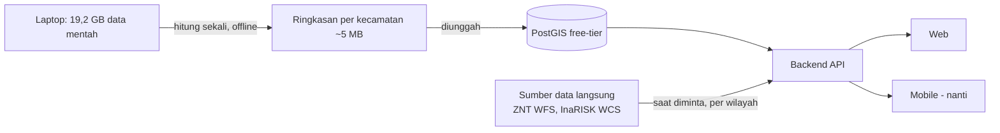
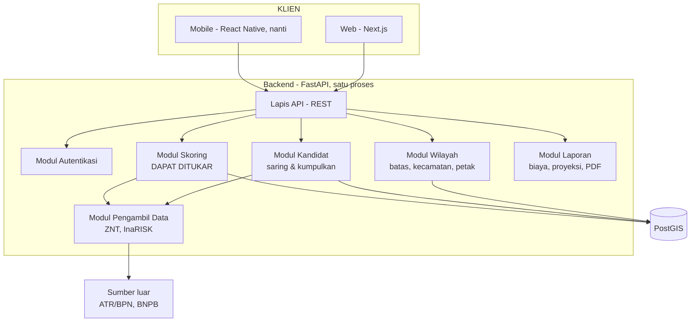
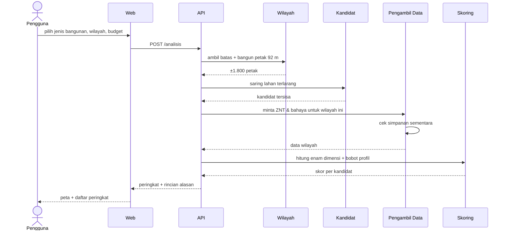
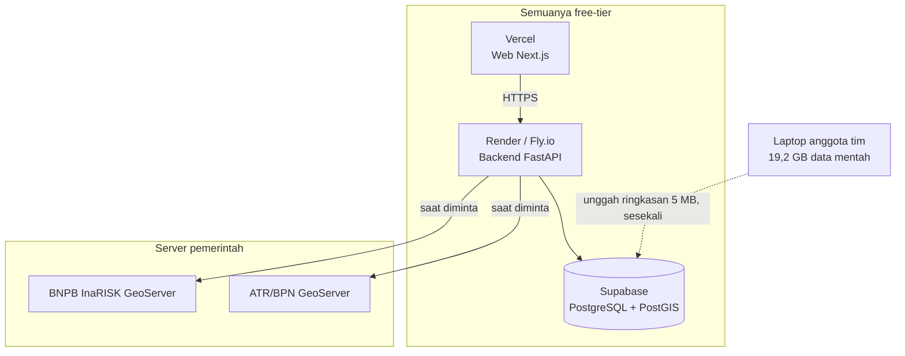

# Arsitektur Sistem BanguninAja

> Disusun 2026-09-11 mengikuti materi kuliah Sesi 09 (Architecture Design
> Concepts and Styles) dan Sesi 10 (Architecture Documentation and
> Patterns): pemilihan gaya arsitektur beserta trade-off-nya, empat
> architectural views, dan evaluasi dengan ATAM.

---

## 1. Kendala yang membentuk arsitektur ini

Arsitektur tidak dipilih karena bagus di atas kertas, melainkan karena
lima kendala berikut. Setiap keputusan di dokumen ini bisa dilacak ke
salah satunya.

| # | Kendala | Dari mana | Akibatnya |
|---|---|---|---|
| K1 | **Budget 0** | `README.md` | Hanya boleh stack sumber terbuka dan hosting free-tier |
| K2 | **Data 19,2 GB** | Hasil pengumpulan | Tidak mungkin diunggah ke hosting gratis |
| K3 | **Harus bisa jadi aplikasi mobile** | Permintaan tim | Backend wajib API-first, bukan server-rendered |
| K4 | **Skala nasional, satuan 92 m** | `DATASET_TODO.md` | Seluruh Indonesia = 224 juta petak, mustahil dihitung di muka |
| K5 | **Mesin skoring belum final** | Keputusan tertunda | Komponen skoring harus bisa ditukar tanpa membongkar sistem |

K3 adalah kendala yang paling menentukan. Kalau aplikasi web dibuat
server-rendered dengan logika menempel di halaman, membuat versi mobile
berarti menulis ulang seluruh logika. Karena itu seluruh kecerdasan
sistem ditaruh di belakang API, dan web hanyalah salah satu klien.

---

## 2. Gaya arsitektur yang dipilih

**Modular monolith dengan backend API-first.**

Artinya: satu aplikasi backend yang dijalankan sebagai satu proses, tapi
dibagi menjadi modul-modul dengan batas yang tegas, dan seluruh
komunikasi ke luar lewat REST API.

### Kenapa bukan microservices

Sesi 09 membahas trade-off keduanya. Untuk proyek ini:

| Pertimbangan | Monolith | Microservices |
|---|---|---|
| Biaya hosting | **Satu proses, muat di free-tier** | Tiap servis butuh instance sendiri — melanggar K1 |
| Ukuran tim | **Cocok untuk 2–4 orang** | Butuh tim per servis |
| Kompleksitas operasional | **Rendah** | Perlu orkestrasi, service discovery, tracing |
| Kecepatan pengembangan awal | **Tinggi** | Lambat di awal |

Microservices menyelesaikan masalah yang belum kami punya (skala tim
besar, penskalaan komponen yang berbeda-beda) dengan ongkos yang
melanggar kendala yang kami punya sekarang (K1).

### Kenapa tetap modular

Modul dipisah tegas supaya kalau nanti benar-benar perlu dipecah,
batasnya sudah ada. Ini yang membedakan *modular monolith* dari
*big ball of mud*.

### Trade-off yang diterima

- **Satu titik kegagalan.** Kalau backend mati, seluruh sistem mati.
  Diterima karena ini proyek kuliah, bukan sistem produksi bertingkat SLA.
- **Penskalaan hanya bisa seluruh aplikasi**, tidak per komponen. Padahal
  komponen skoring jauh lebih berat daripada komponen autentikasi.
  Diterima untuk sekarang; itulah alasan batas modul dijaga.
- **Bahasa terkunci di Python** untuk seluruh backend.

---

## 3. Strategi data: dua lapis

Ini jawaban atas K2 dan K4, dan merupakan keputusan arsitektur paling
penting di dokumen ini.

Data 19,2 GB tidak akan pernah diunggah. Sebagai gantinya:

| Lapis | Isi | Ukuran | Kapan dihitung | Di mana |
|---|---|---|---|---|
| **Kasar** | Skor ringkas per kecamatan, ±7.200 baris | **~5 MB** | Sekali, di laptop | PostGIS |
| **Halus** | Petak 92 m untuk wilayah yang dipilih | ±1.800 petak | Saat diminta | Dihitung langsung, disimpan sementara |

Alurnya:



Pengguna membuka aplikasi dan langsung melihat peta Indonesia berwarna
dari lapis kasar. Begitu ia memilih satu kecamatan, barulah lapis halus
dihitung khusus untuk wilayah itu.

**Kenapa ini bekerja:** sumber datanya cepat diakses per wilayah. ZNT
0,16 detik, InaRISK 14 detik untuk satu kota. Jadi tidak perlu menimbun.

**Konsekuensi jujur:** aplikasi menjadi bergantung pada ketersediaan
server ATR/BPN dan BNPB saat dipakai. Mitigasinya ada di bagian 7.

---

## 4. Empat architectural views

Sesuai Sesi 10.

### 4.1 Logical View — modul dan tanggung jawabnya



| Modul | Tanggung jawab | Tidak boleh |
|---|---|---|
| **Autentikasi** | Login, sesi, peran pengguna | Tahu apa pun soal skoring |
| **Wilayah** | Batas administratif, membangun petak 92 m | Menilai kandidat |
| **Kandidat** | Menyaring lahan terlarang, mengumpulkan calon | Menghitung skor |
| **Skoring** | Menghitung enam dimensi, menggabung dengan bobot | Mengambil data mentah sendiri |
| **Laporan** | Estimasi biaya, proyeksi, ekspor PDF | Mengubah peringkat |
| **Pengambil Data** | Bicara ke server luar, menyimpan sementara | Menafsirkan data |

Batas ini yang membuat **K5** teratasi: modul Skoring menerima masukan
yang sudah rapi dan mengembalikan angka. Isinya mau MCDM berbobot atau
model terlatih, modul lain tidak perlu tahu.

### 4.2 Process View — apa yang terjadi saat pengguna mencari lokasi



Langkah yang lama hanyalah pengambilan data luar (belasan detik untuk
wilayah yang belum pernah diminta). Karena itu prosesnya **asinkron**:
API langsung mengembalikan nomor pekerjaan, klien memantau kemajuannya.
Pilihan ini penting untuk mobile, tempat koneksi lebih rapuh.

### 4.3 Development View — susunan kode

```
BanguninAja/
├── backend/                  FastAPI
│   ├── api/                  definisi endpoint
│   ├── modul/
│   │   ├── autentikasi/
│   │   ├── wilayah/
│   │   ├── kandidat/
│   │   ├── skoring/          <- bagian yang dapat ditukar
│   │   ├── laporan/
│   │   └── pengambil/
│   ├── model/                skema basis data
│   └── skema/                bentuk permintaan & jawaban (Pydantic)
├── web/                      Next.js
│   ├── app/                  halaman
│   ├── komponen/
│   └── klien-api/            DIHASILKAN dari OpenAPI
├── mobile/                   React Native - nanti
│   └── klien-api/            klien yang SAMA, dihasilkan dari OpenAPI
├── scripts/                  pengumpul data (sudah ada)
└── docs/
```

**Kunci agar mobile mudah menyusul:** FastAPI menghasilkan berkas OpenAPI
secara otomatis. Dari berkas itu, klien API untuk web dan mobile
di-*generate*, bukan ditulis tangan. Jadi saat backend berubah, kedua
klien ikut berubah dan ketidakcocokan ketahuan saat kompilasi.

### 4.4 Physical View — penempatan



Laptop tim adalah bagian sah dari arsitektur ini: ia mesin pengolah
luring yang menghasilkan lapis kasar. Tidak melayani permintaan pengguna.

---

## 5. Tumpukan teknologi

| Bagian | Pilihan | Alasan terhadap kendala |
|---|---|---|
| Backend | **FastAPI (Python)** | Seluruh skrip data sudah Python; OpenAPI otomatis untuk K3 |
| Basis data | **PostgreSQL + PostGIS** | Kueri spasial; free-tier Supabase cukup untuk 5 MB (K1) |
| Web | **Next.js + React + TypeScript** | Vercel gratis (K1); TypeScript berbagi tipe dengan mobile (K3) |
| Peta | **MapLibre GL** | Gratis tanpa token, dan **punya versi React Native** — peta tidak perlu diganti saat ke mobile (K1, K3) |
| Gaya visual | **Tailwind CSS** | Cepat mencapai tampilan rapi seperti Linear |
| Mobile (nanti) | **React Native + Expo** | Berbagi TypeScript, tipe API, dan MapLibre dengan web |
| Pemrosesan raster | **GDAL** | Sudah dipakai seluruh skrip pengumpul |

**Catatan MapLibre.** Ini satu-satunya pilihan peta yang bertahan dari web
ke mobile tanpa ganti pustaka. Mapbox berbayar setelah kuota, melanggar
K1. Google Maps tidak punya dukungan raster kustom yang kita butuhkan.

---

## 6. Jalur ke mobile

Yang dikerjakan **sekarang** supaya mobile nanti tidak perlu menulis ulang:

1. **Tidak ada logika bisnis di frontend.** Web hanya menampilkan apa yang
   dikembalikan API. Skor, penyaringan, peringkat — semuanya di backend.
2. **API tanpa status.** Tidak ada sesi yang menempel di server, memakai
   token. Klien mobile tidak bisa mengandalkan cookie browser.
3. **Klien API di-generate dari OpenAPI**, tidak ditulis tangan.
4. **Analisis berjalan asinkron.** Klien mengirim permintaan, menerima
   nomor pekerjaan, lalu memantau. Aman untuk koneksi seluler yang putus-nyambung.
5. **Ukuran jawaban dijaga.** Geometri disederhanakan sebelum dikirim;
   peringkat dikirim bertahap, bukan 1.800 petak sekaligus.

Kalau kelimanya dipatuhi, membuat versi mobile berarti menulis ulang
**tampilan saja** — bukan sistemnya.

---

## 7. Evaluasi arsitektur (ATAM)

Sesuai Sesi 10. Mengidentifikasi titik sensitif dan trade-off.

| Atribut kualitas | Skenario | Respons arsitektur | Risiko |
|---|---|---|---|
| **Kinerja** | Pengguna menganalisis kecamatan yang belum pernah diminta | Lapis halus dihitung saat itu juga, ±15 detik | ⚠️ Terasa lambat. Dikurangi dengan proses asinkron + indikator kemajuan |
| **Kinerja** | Pengguna membuka peta nasional | Lapis kasar 5 MB, langsung | ✅ Rendah |
| **Ketersediaan** | Server ATR/BPN mati saat dipakai | Simpanan sementara melayani wilayah yang pernah diminta | ⚠️ Wilayah baru gagal. **Risiko nyata** — server pemerintah sudah terbukti tidak andal |
| **Kemudahan diubah** | Tim memutuskan ganti MCDM ke model terlatih | Hanya modul Skoring yang diganti | ✅ Rendah — inilah alasan batas modul dijaga |
| **Portabilitas** | Aplikasi mobile dibuat | Klien baru memanggil API yang sama | ✅ Rendah, asalkan bagian 6 dipatuhi |
| **Biaya** | Pengguna bertambah | Free-tier punya batas jam komputasi | ⚠️ Akan menabrak batas. Di luar lingkup proyek kuliah |
| **Keamanan** | Data pengguna | Token, HTTPS, tanpa data pribadi sensitif | ✅ Rendah |

### Titik sensitif utama

**Ketergantungan pada server pemerintah saat aplikasi berjalan.** Ini
kelemahan terbesar arsitektur ini, dan bukan kelemahan teoretis: selama
pengumpulan data, server ArcGIS BNPB terbukti rusak total, RDTR ATR/BPN
membalas 404, dan portal Pusiknas sempat 504.

**Mitigasi yang direncanakan:**

1. Simpanan sementara per wilayah, tidak dihapus otomatis.
2. Wilayah kota besar dihitung di muka dan disimpan permanen.
3. Kalau sumber luar mati, sistem tetap menjawab dengan lapis kasar
   disertai keterangan jujur bahwa rincian petak sedang tidak tersedia.

### Trade-off yang disadari

| Dipilih | Dikorbankan |
|---|---|
| Monolith | Penskalaan per komponen |
| Data diambil saat diminta | Kemandirian dari server luar |
| Lapis kasar per kecamatan | Ketelitian pada tampilan nasional |
| API-first | Waktu pengembangan awal sedikit lebih lama daripada server-rendered |

---

## 8. Yang belum diputuskan

1. **Isi modul Skoring** — MCDM berbobot atau model terlatih. Arsitektur
   ini sengaja dibuat tidak peduli, tapi keputusannya tetap dibutuhkan
   sebelum modul itu ditulis. Lihat `desain-data.md` bagian 1.
2. **Autentikasi** — apakah aplikasi perlu login sama sekali untuk MVP.
   Kalau tidak, modul Autentikasi bisa ditunda.
3. **Batas simpanan sementara** — berapa lama data wilayah disimpan
   sebelum ditarik ulang.
